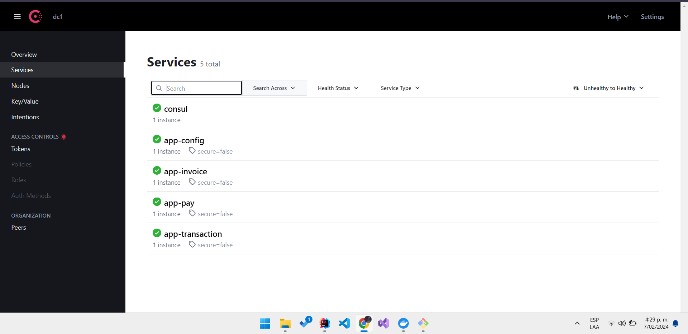
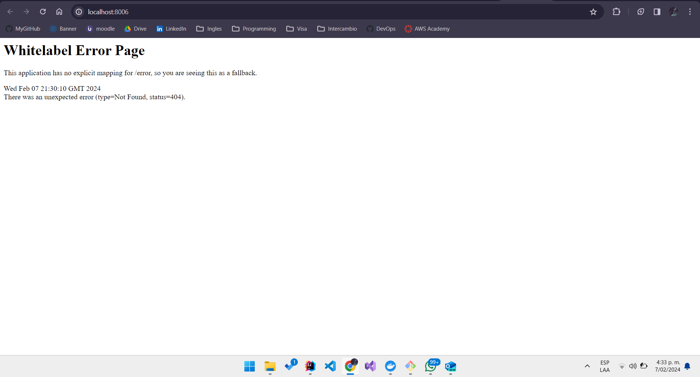
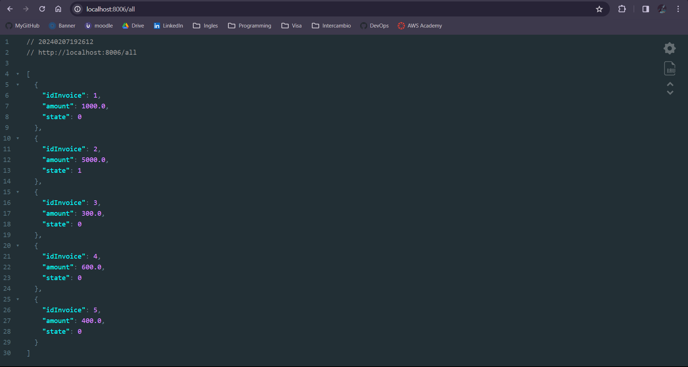
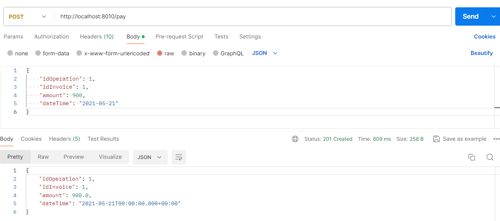
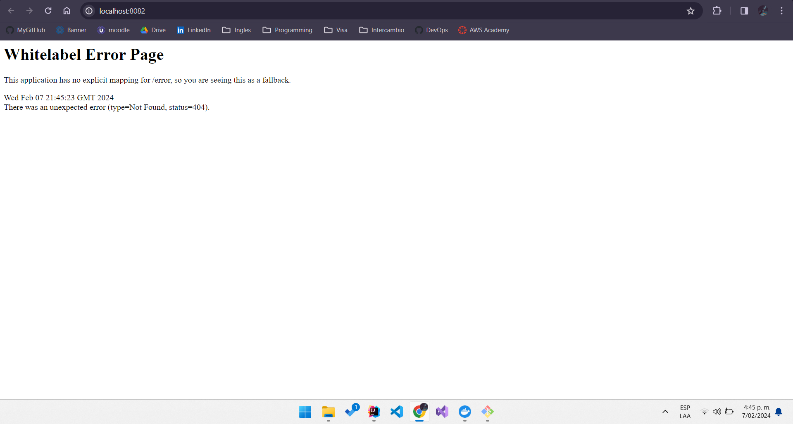
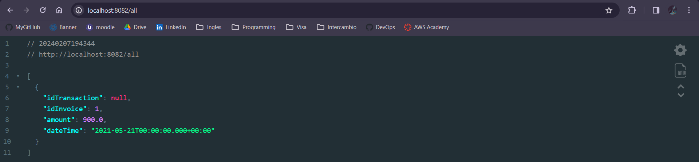

# Microservices with Spring Boot


## Technologies used

- Spring Boot (Java Framework JDK v11+)
- Gradle (Dependency manager)
- Postman (Test of endpoints/rest services)
- Postgresql (Database)
- MySQL (Database)
- MongoDB (NoSQL Database)
- Kafka (Messaging Manager)
- Github (Repository for project and Microservices configurations)


## Steps to deployment

## 1. Configuration DockerFile
  The First step we need to do is replace the ports of the every microservice's Dockerfile with the correct ones that are in the properties files of each microservice. **The ports of the properties and the Dockerfiles must be the same**

  ### 1.1 App-config service
  ```Dockerfile
FROM openjdk:13-alpine as stage1
COPY . /app
WORKDIR /app
RUN chmod 777 gradlew
RUN ./gradlew clean
RUN ./gradlew bootJar


FROM openjdk:13-alpine
EXPOSE 8888
COPY --from=stage1 /app/build/libs/app-config-1.0.0.jar app-config.jar
#ADD ./build/libs/app-config-1.0.0.jar app-config.jar
ENTRYPOINT ["java", "-jar", "/app-config.jar"]
  ```
  ### 1.2 App-invoice service
  ```Dockerfile
FROM openjdk:13-alpine as stage1
COPY . /app
WORKDIR /app
RUN chmod 777 gradlew
RUN ./gradlew clean
RUN ./gradlew bootJar


FROM openjdk:13-alpine
EXPOSE 8006
COPY --from=stage1 /app/build/libs/app-invoice-1.0.0.jar app-invoice.jar
#ADD ./build/libs/app-config-1.0.0.jar app-config.jar
ENTRYPOINT ["java", "-jar", "/app-invoice.jar"]
  ```

  ### 1.3 App-pay service
  ```Dockerfile
FROM openjdk:13-alpine as stage1
COPY . /app
WORKDIR /app
RUN chmod 777 gradlew
RUN ./gradlew clean
RUN ./gradlew bootJar


FROM openjdk:13-alpine
EXPOSE 8010
COPY --from=stage1 /app/build/libs/app-pay-1.0.0.jar app-pay.jar
#ADD ./build/libs/app-config-1.0.0.jar app-config.jar
ENTRYPOINT ["java", "-jar", "/app-pay.jar"]
  ```

  ### 1.4 App-transaction service
  ```Dockerfile
FROM openjdk:13-alpine as stage1
COPY . /app
WORKDIR /app
RUN chmod 777 gradlew
RUN ./gradlew clean
RUN ./gradlew bootJar


FROM openjdk:13-alpine
EXPOSE 8082
COPY --from=stage1 /app/build/libs/app-transaction-1.0.0.jar app-transaction.jar
#ADD ./build/libs/app-config-1.0.0.jar app-config.jar
ENTRYPOINT ["java", "-jar", "/app-transaction.jar"]
  ```
## 2. Build and Push Docker Image
Run the following commands to build and push the image of each microservice to DockerHub

```bash
docker build -t nombreimagen .
```

```bash
docker image tag nombreimagen usuario-docker/nombreimagen:tag
```

```bash
docker image push usuario-docker/nombreimagen:tag
```

  ### DockerHub Repository
  


## 3. Execute the script

We need to be in the folder where all the yml files are and where the script bash is to deploy the microservices

```bash
cd deploy
```
To execute the script is needed an operating system basen on Unix/Linux or we can try to execute it in the console of Git Bash

```bash
chmod +x deploy.sh
./deploy.sh
```

## 4. Load Data in Postgres database


## 5. Test the microservices


### App-Invoice




### App-Pay



### App-Transaction




  
    


