# Microservices with Spring Boot


## Technologies used

- Spring Boot (Java Framework JDK v11+)
- Gradle (Dependency manager)
- Postman (Test of endpoints/rest services)
- Postgresql (Database)
- MySQL (Database)
- MongoDB (NoSQL Database)
- Kafka (Messaging Manager)
- Github (Repository for project and Microservices configurations)


## Steps to deployment

## 1. Configuration DockerFile
  The First step we need to do is replace the ports of the every microservice's Dockerfile with the correct ones that are in the properties files of each microservice. **The ports of the properties and the Dockerfiles must be the same**

  ### 1.1 App-config service
  ```Dockerfile
FROM openjdk:13-alpine as stage1
COPY . /app
WORKDIR /app
RUN chmod 777 gradlew
RUN ./gradlew clean
RUN ./gradlew bootJar


FROM openjdk:13-alpine
EXPOSE 8888
COPY --from=stage1 /app/build/libs/app-config-1.0.0.jar app-config.jar
#ADD ./build/libs/app-config-1.0.0.jar app-config.jar
ENTRYPOINT ["java", "-jar", "/app-config.jar"]
  ```
  ### 1.2 App-invoice service
  ```Dockerfile
FROM openjdk:13-alpine as stage1
COPY . /app
WORKDIR /app
RUN chmod 777 gradlew
RUN ./gradlew clean
RUN ./gradlew bootJar


FROM openjdk:13-alpine
EXPOSE 8006
COPY --from=stage1 /app/build/libs/app-invoice-1.0.0.jar app-invoice.jar
#ADD ./build/libs/app-config-1.0.0.jar app-config.jar
ENTRYPOINT ["java", "-jar", "/app-invoice.jar"]
  ```

  ### 1.3 App-pay service
  ```Dockerfile
FROM openjdk:13-alpine as stage1
COPY . /app
WORKDIR /app
RUN chmod 777 gradlew
RUN ./gradlew clean
RUN ./gradlew bootJar


FROM openjdk:13-alpine
EXPOSE 8010
COPY --from=stage1 /app/build/libs/app-pay-1.0.0.jar app-pay.jar
#ADD ./build/libs/app-config-1.0.0.jar app-config.jar
ENTRYPOINT ["java", "-jar", "/app-pay.jar"]
  ```

  ### 1.4 App-transaction service
  ```Dockerfile
FROM openjdk:13-alpine as stage1
COPY . /app
WORKDIR /app
RUN chmod 777 gradlew
RUN ./gradlew clean
RUN ./gradlew bootJar


FROM openjdk:13-alpine
EXPOSE 8082
COPY --from=stage1 /app/build/libs/app-transaction-1.0.0.jar app-transaction.jar
#ADD ./build/libs/app-config-1.0.0.jar app-config.jar
ENTRYPOINT ["java", "-jar", "/app-transaction.jar"]
  ```
## 2. Build and Push Docker Image
Run the following commands to build and push the image of each microservice to DockerHub

```bash
docker build -t nombreimagen .
```

```bash
docker image tag nombreimagen usuario-docker/nombreimagen:tag
```

```bash
docker image push usuario-docker/nombreimagen:tag
```

  ### DockerHub Repository
  


## 3. Execute the script

We need to be in the folder where all the yml files are and where the script bash is to deploy the microservices

```bash
cd deploy
```
To execute the script is needed an operating system basen on Unix/Linux or we can try to execute it in the console of Git Bash

```bash
chmod +x deploy.sh
./deploy.sh
```

## 4. Evidence of Consul
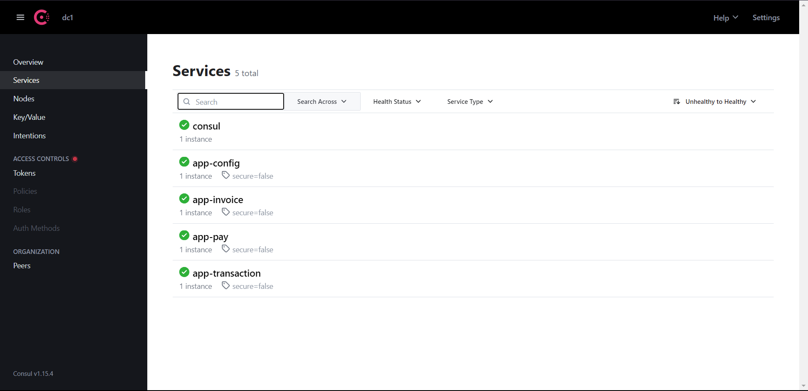

## 5. Load Data in Postgres database
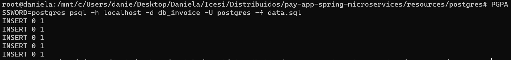

## 6. Test the microservices
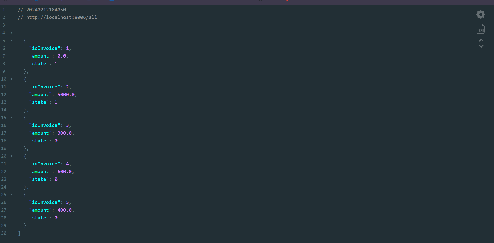

### App-Invoice
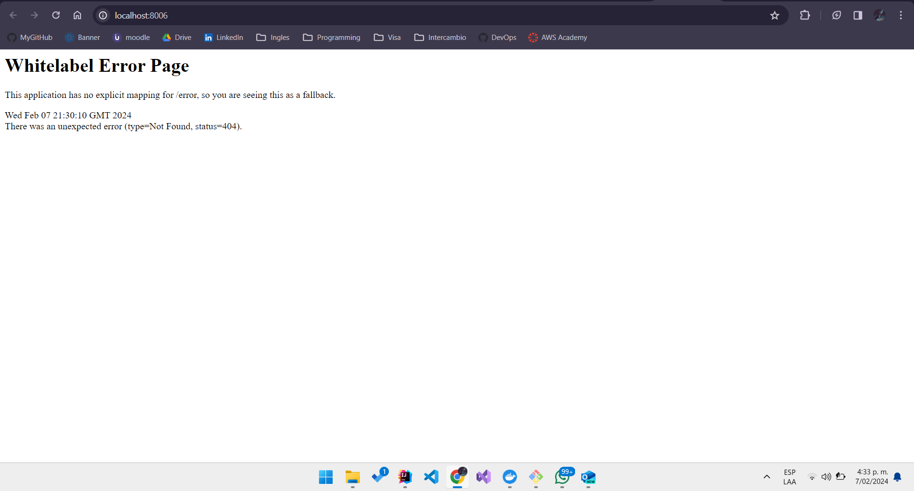

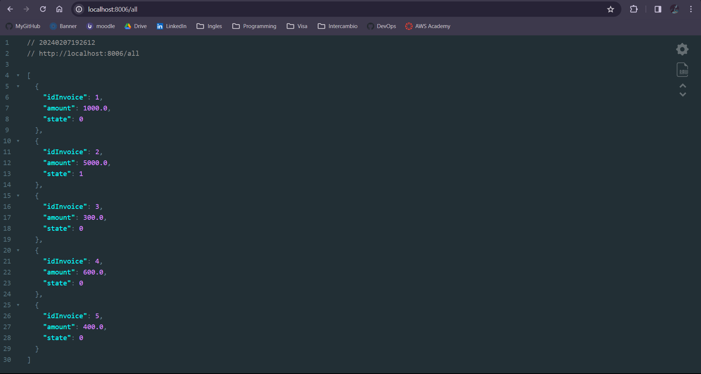

### App-Invoice Fixed
A payment is made and the invoice 1 is updated

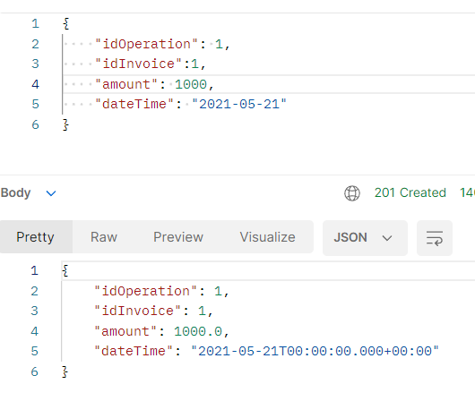


### App-Pay

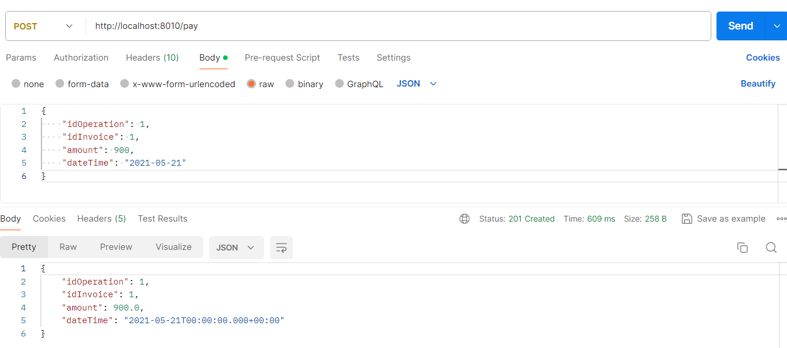

### App-Transaction
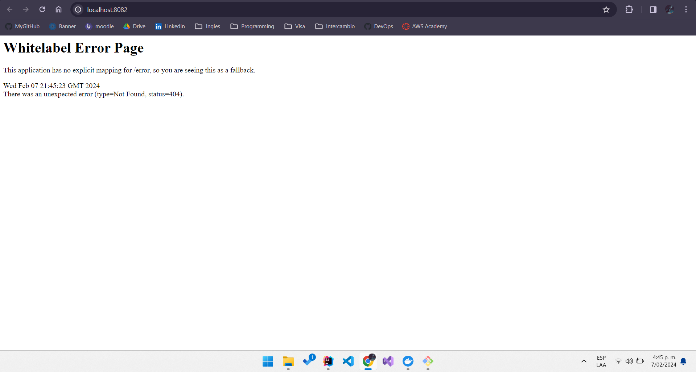
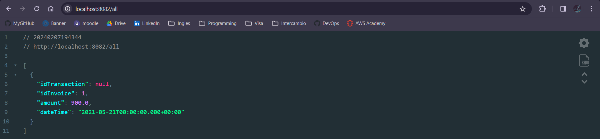


## 7. Load Balancer and Api Gateway

  ### 7.1 Configuration of Load Balancer: haproxy.cfg
The .cfg file is needed to configure the path of the microservices from the load balancer.
  ```Dockerfile
    defaults
      timeout connect 5s
      timeout client 1m
      timeout server 1m

    frontend stats
       bind *:1936
       mode http
       stats uri /
       stats show-legends
       no log
    
    frontend http_front
       bind *:80
       mode http
       acl url_config path_beg /config
       use_backend config_back if url_config
       acl url_invoice path_beg /invoice
       use_backend app_invoice if url_invoice
       acl url_pay path_beg /pay
       use_backend app_pay if url_pay
       acl url_transaction path_beg /transaction
       use_backend app_transaction if url_transaction
    
    
    backend config_back
        mode http
        balance roundrobin
        http-request set-path "%[path,regsub(^/config/,/)]"
        server appconfig app-config.service.consul:8888 resolvers consul resolve-prefer ipv4 check
    
    backend app_invoice
        mode http
        balance roundrobin
        http-request set-path "%[path,regsub(^/invoice/,/)]"
        server appinvoice app-invoice.service.consul:8006 resolvers consul resolve-prefer ipv4 check
    
    backend app_pay
        mode http
        balance roundrobin
        http-request set-path "%[path,regsub(^/pay/,/)]"
        server apppay app-pay.service.consul:8010 resolvers consul resolve-prefer ipv4 check
    
    backend app_transaction
        mode http
        balance roundrobin
        http-request set-path "%[path,regsub(^/transaction/,/)]"
        server apptran app-transaction.service.consul:8082 resolvers consul resolve-prefer ipv4 check
    
    resolvers consul
        nameserver consul consul:8600
        accepted_payload_size 8192
        hold valid 5s
  ```
  ### 7.2 Build and Push Docker Image
```bash
docker build -t nombre-usuario/loadbalancer:1 .
docker push nombre-usuario/loadbalancer:1
```
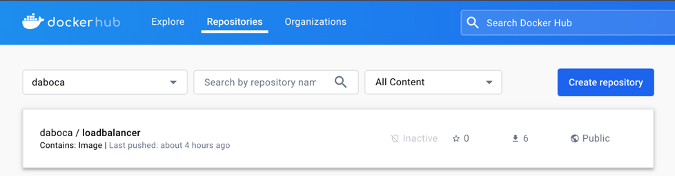

  ### 7.3 Configuration of Gateway: gateway.config.yml
The .yml file is needed to configure the path of the microservices from the gateway.
  ```Dockerfile
    http:
      port: 8080
    admin:
      port: 9876
      host: localhost
    
    apiEndpoints:
      appconfig:
        host: localhost
        paths: [ '/config','/config/*' ]
      appinvoice:
        host: localhost
        paths: [ '/invoice','/invoice/*' ]
      apppay:
        host: localhost
        paths: [ '/pay','/pay/*' ]
      apptransaction:
        host: localhost
        paths: [ '/transaction','/transaction/*' ]
    
    serviceEndpoints:
      appconfig:
        url: 'http://loadbalancer/config/'
      appinvoice:
        url: 'http://loadbalancer/invoice/'
      apppay:
        url: 'http://loadbalancer/pay/'
      apptransaction:
        url: 'http://loadbalancer/transaction/'
    
    policies:
      - basic-auth
      - cors
      - expression
      - key-auth
      - log
      - oauth2
      - proxy
      - rate-limit
    pipelines:
      default:
        apiEndpoints:
          - appconfig
          - appinvoice
          - apppay
          - apptransaction
        policies:
          # Uncomment `key-auth:` when instructed to in the Getting Started guide.
          - key-auth:
          - proxy:
              - action:
                  serviceEndpoint: appconfig
                  changeOrigin: true
                  prependPath: false
                  ignorePath: false
                  stripPath: false
              - action:
                  serviceEndpoint: apppay
                  changeOrigin: true
                  prependPath: false
                  ignorePath: false
                  stripPath: false
              - action:
                  serviceEndpoint: apptransaction
                  changeOrigin: true
                  prependPath: false
                  ignorePath: false
                  stripPath: false
              - action:
                  serviceEndpoint: appinvoice
                  changeOrigin: true
                  prependPath: false
                  ignorePath: false
                  stripPath: false
  ```

  ### 7.3 Build Docker-Compose
  ```Dockerfile
version: '3'

services:
  loadbalancer:
    container_name: loadbalancer
    image: daboca/loadbalancer:1
    ports:
      - "8000:80"
      - "1936:1936"
    networks:
      - distribuidos

  express-gateway-data-store:
    container_name: express-gateway-data-store
    image: redis:alpine
    ports:
      - "6379:6379"
    networks:
      - distribuidos

  express-gateway:
    container_name: express-gateway
    image: express-gateway
    ports:
      - "8080:8080"
      - "9876:9876"
    volumes:
      - type: bind
        source: ../appgw
        target: /var/lib/eg
    networks:
      - distribuidos

networks:
  distribuidos:
    external: true
  ```

  ## 8. Evidence of working
  ### 8.1 Load Balancer

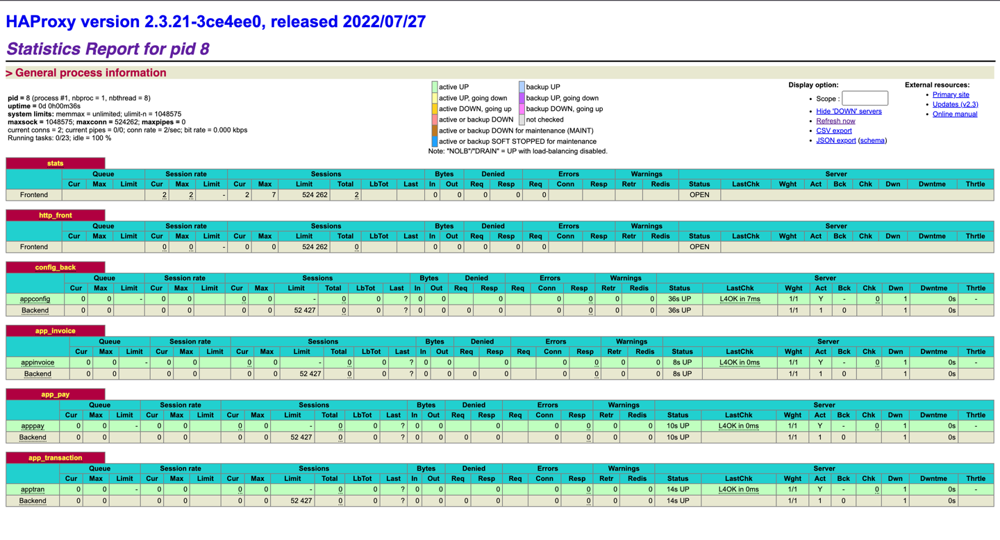

Invoice
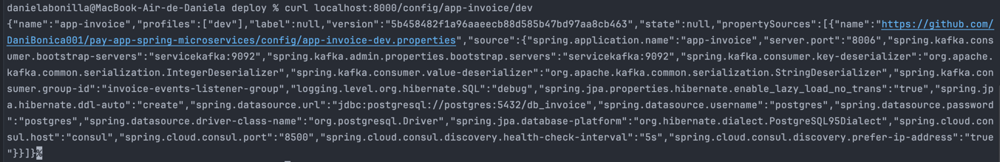

Pay
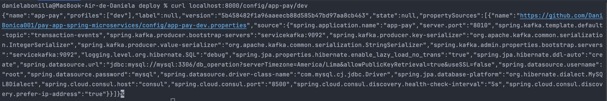

Transaction
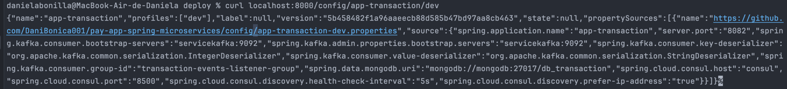


### 8.2 Api Gateway
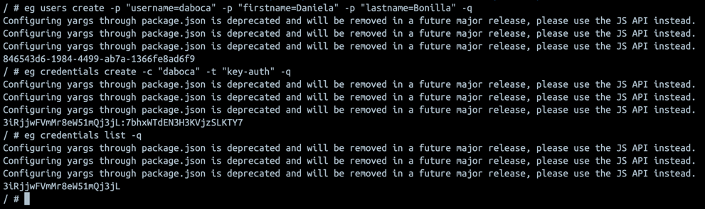
```bash
 curl -H "Authorization: apiKey 3iRjjwFVmMr8eW51mQj3jL:7bhxWTdEN3H3KVjzSLKTY7" http://localhost:8080/config/app-pay/dev
```
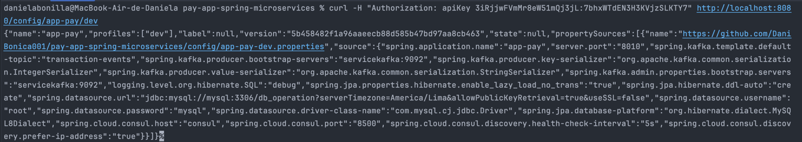


  
    


